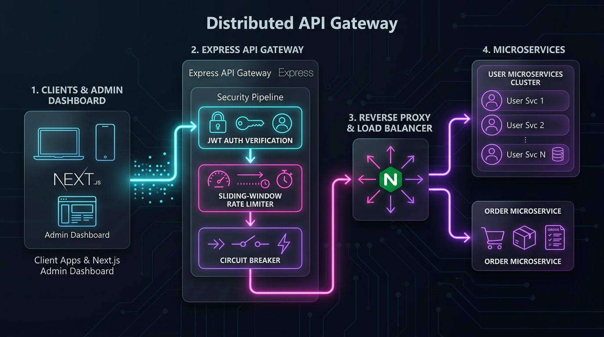
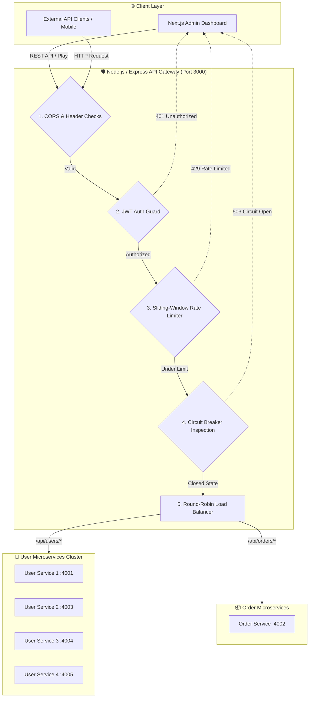
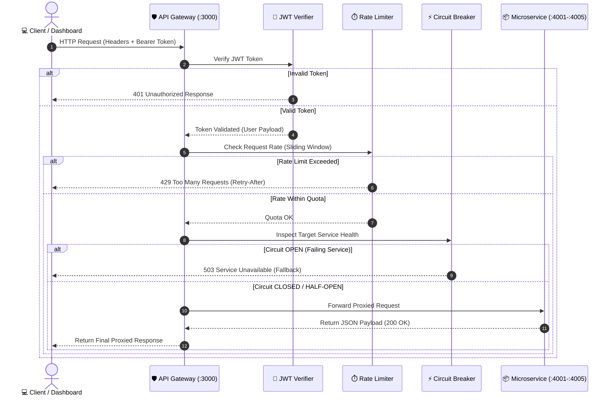

<div align="center">

# 🛡️ Distributed API Gateway & Next.js Admin Dashboard

### *High-performance, fault-tolerant API proxy, dynamic load balancer, and real-time observability dashboard.*

[](https://nodejs.org)
[](https://expressjs.com)
[](https://nextjs.org)
[](https://www.typescriptlang.org/)
[](https://tailwindcss.com)
[](https://www.docker.com/)
[](LICENSE)

---

[🚀 Quick Start](#-quick-start) • [🎨 Architecture Workflow](#-architecture--request-workflow) • [✨ Key Features](#-key-features) • [🧪 Live Playground](#-interactive-playground-guide) • [🔌 API Specs](#-api-endpoints-reference) • [🐳 Docker](#-docker-containerization)

</div>

<br/>

## 📌 Overview

The **Distributed API Gateway & Next.js Admin Dashboard** is an enterprise-grade backend infrastructure and frontend observability suite. It provides reverse-proxy routing, sliding-window rate limiting, JWT authentication, fault-tolerant circuit breaking, and load balancing across microservice clusters—paired with a live Postman-style interactive API playground and real-time security stream dashboard.

---

## 🎨 Architecture & Request Workflow

Below is the complete visual workflow of how requests are intercepted, authenticated, rate-limited, and proxied to downstream microservice clusters.

### 🖼️ System Workflow Diagram



<p align="center">
  <sub><b>Figure 1:</b> Enterprise Request Lifecycle & Distributed Gateway Pipeline</sub>
</p>

<br/>

### 🔄 Interactive Topology Diagram (Mermaid)



<br/>

<details>
<summary><b>🔍 Click to view Request Lifecycle Sequence Diagram</b></summary>

<br/>



</details>

---

## ✨ Key Features

| Feature | Description | Tech Stack |
| :--- | :--- | :--- |
| **🛡️ Dynamic API Reverse Proxy** | Transparent routing and path rewriting between clients and downstream microservices. | Express Http Proxy |
| **⏱️ Sliding-Window Rate Limiter** | Prevents abuse by strictly tracking request throughput per IP / Client ID over time windows. | Node.js / Memory / Redis |
| **⚡ Circuit Breaker Pattern** | Automatically trips open when service failure rates spike, avoiding cascading outages. | Custom Resilience Logic |
| **🔄 Round-Robin Load Balancer** | Distributes traffic evenly across replicated instances of mock user microservices. | Dynamic Target Selection |
| **🔑 JWT Security Pipeline** | Token verification, payload enforcement, and unauthorized access protection. | JsonWebToken |
| **📊 Real-time Dashboard** | Live Postman-style playground, dynamic chart metrics, logs stream, and status indicators. | Next.js 14, React, Chart.js |
| **🐳 Containerized Orchestration** | Complete multi-container setup ready for seamless local deployment. | Docker & Docker Compose |

---

## 🚀 Quick Start

### Prerequisites
- **Node.js** v18+ 
- **npm** v9+
- *(Optional)* **Docker & Docker Compose**

### Option A: Running All Services with One Command (Recommended)

Run the entire gateway system, microservice cluster, and dashboard concurrently:

```bash
# 1. Clone repo & install dependencies
git clone https://github.com/gannu19/API-GATEWAY.git
cd API-GATEWAY
npm install

# 2. Launch all backend services & frontend dashboard concurrently
npm run dev:all
```

> 🌐 **Dashboard:** Access the Next.js Web UI at [http://localhost:3005](http://localhost:3005)  
> 🛡️ **API Gateway:** Listening at [http://localhost:3000](http://localhost:3000)

---

### Option B: Running Individual Terminals

If you prefer launching each component separately in distinct terminal windows:

```bash
# Terminal 1: User Microservice Instance 1 (Port 4001)
npm run user-service

# Terminal 2: User Microservice Instance 2 (Port 4003)
npm run user-service-2

# Terminal 3: User Microservice Instance 3 (Port 4004)
npm run user-service-3

# Terminal 4: User Microservice Instance 4 (Port 4005)
npm run user-service-4

# Terminal 5: Order Microservice (Port 4002)
npm run order-service

# Terminal 6: API Gateway Server (Port 3000)
npm run gateway

# Terminal 7: Next.js Frontend Dashboard (Port 3005)
npm run dev
```

---

## 🧪 Interactive Playground Guide

Try out the gateway's real-time security and rate-limiting enforcement in 4 quick steps:

```
+-----------------------------------------------------------------------+
|  STEP 1: Open http://localhost:3005 in your web browser.               |
|  STEP 2: Click "Get JWT Token" button to generate a test token.       |
|  STEP 3: Select GET /api/orders/my-orders (Limit: 5 requests/min).    |
|  STEP 4: Click "Send Request" rapidly 6 times in succession.          |
+-----------------------------------------------------------------------+
```

* **Requests 1 – 5:** Return `200 OK` with JSON order data. The rate limiter visualizer counts down remaining requests.
* **Request 6:** Instantly returns **`429 Rate Limited`** and triggers a red security alert in the live log stream!

---

## 🔌 API Endpoints Reference

<details open>
<summary><b>📚 Core Gateway Routes Specification</b></summary>

<br/>

| Endpoint | Method | Security | Rate Limit | Target Service | Purpose |
| :--- | :---: | :---: | :---: | :--- | :--- |
| `/api/auth/token` | `POST` | Public | None | Gateway Auth | Issues signed JWT access token for testing |
| `/api/users/profile` | `GET` | Bearer JWT | 10 req/min | User Cluster (`:4001-4005`) | Returns current user profile with load balancer instance ID |
| `/api/users/list` | `GET` | Bearer JWT | 10 req/min | User Cluster (`:4001-4005`) | Retrieves paginated user list |
| `/api/orders/my-orders` | `GET` | Bearer JWT | 5 req/min | Order Service (`:4002`) | Retrieves orders for authenticated user |
| `/health` | `GET` | Public | None | Gateway Server | Health check & microservice status |

</details>

---

## 🐳 Docker Containerization

Spin up the entire stack (Gateway, 4 User Services, Order Service, Next.js Dashboard, Redis) using Docker Compose:

```bash
# Build and start all containers in detached mode
docker-compose up -d --build

# View container logs in real time
docker-compose logs -f

# Shut down all services
docker-compose down
```

<details>
<summary><b>🐋 View Docker Container Matrix</b></summary>

<br/>

| Container Name | Internal Port | Host Port | Description |
| :--- | :---: | :---: | :--- |
| `api-gateway-server` | `3000` | `3000` | Node.js Reverse Proxy Gateway |
| `api-gateway-dashboard` | `3005` | `3005` | Next.js Observability UI |
| `api-gateway-redis` | `6379` | `6379` | Distributed Rate Limiter State |
| `user-service-1` | `4001` | `4001` | User Microservice Node #1 |
| `user-service-2` | `4003` | `4003` | User Microservice Node #2 |
| `user-service-3` | `4004` | `4004` | User Microservice Node #3 |
| `user-service-4` | `4005` | `4005` | User Microservice Node #4 |
| `order-service` | `4002` | `4002` | Order Microservice Node |

</details>

---

## 📁 Project Structure

```
API-GATEWAY/
├── 📁 app/                     # Next.js 14 App Router (Frontend Dashboard)
│   ├── 📄 layout.tsx           # Global Root Layout & Font imports
│   ├── 📄 page.tsx             # Interactive Dashboard & Postman-style UI
│   └── 📄 globals.css          # Tailwind CSS styling & animations
├── 📁 assets/                  # Documentation images & diagrams
│   └── 🖼️ api_gateway_workflow.jpg # Architectural workflow diagram
├── 📁 backend/                 # API Gateway Core & Microservices
│   ├── 📁 config/              # Gateway configuration & route mappings
│   ├── 📁 db/                  # In-memory storage / Mock databases
│   ├── 📁 middleware/          # JWT Auth, Rate Limiter & Circuit Breaker
│   ├── 📁 mock-services/       # User Microservices (x4) & Order Service
│   └── 📄 server.ts            # Express Gateway Entry point
├── 📄 docker-compose.yml       # Docker multi-service composition
├── 📄 Dockerfile.gateway       # Docker build for API Gateway
├── 📄 Dockerfile.dashboard     # Docker build for Next.js UI
├── 📄 Dockerfile.microservice  # Docker build for mock services
├── 📄 package.json             # Dependencies & execution scripts
└── 📄 README.md                # Project documentation
```

---

## ⚙️ Environment Variables

Copy `.env.example` to `.env` to customize system defaults:

```env
# Gateway Configuration
GATEWAY_PORT=3000
SECRET_KEY=super_secret_jwt_key_change_in_production

# Microservice Target Ports
USER_SERVICE_PORT=4001
USER_SERVICE_2_PORT=4003
USER_SERVICE_3_PORT=4004
USER_SERVICE_4_PORT=4005
ORDER_SERVICE_PORT=4002

# Redis Cache (Optional for distributed rate-limiting)
REDIS_URL=redis://localhost:6379
```

---

## 🛠️ Available NPM Scripts

| Command | Description |
| :--- | :--- |
| `npm run dev:all` | 🚀 Starts all 4 User Services, Order Service, Gateway, and Dashboard concurrently |
| `npm run dev` | 💻 Launches Next.js frontend dashboard only (`:3005`) |
| `npm run gateway` | 🛡️ Launches API Gateway server only (`:3000`) |
| `npm run user-service` | 👥 Launches User Microservice #1 (`:4001`) |
| `npm run order-service` | 📦 Launches Order Microservice (`:4002`) |
| `npm run build` | 🏗️ Compiles Next.js frontend for production |

---

## ❓ FAQ & Troubleshooting

<details>
<summary><b>🔴 Port 3000 / 3005 already in use?</b></summary>
<br/>
You can override port settings in `.env` or run:
```bash
# On Windows PowerShell:
Stop-Process -Id (Get-NetTCPConnection -LocalPort 3000).OwningProcess -Force
```
</details>

<details>
<summary><b>🔴 Requests failing with 401 Unauthorized?</b></summary>
<br/>
Make sure to click <b>"Get JWT Token"</b> in the dashboard playground UI first, which automatically attaches the <code>Authorization: Bearer &lt;token&gt;</code> header to your API calls.
</details>

---

<div align="center">

Made with ❤️ for scalable microservice architectures.

[⭐ Star this repository](https://github.com/gannu19/API-GATEWAY) • [🐛 Report Bug](https://github.com/gannu19/API-GATEWAY/issues) • [💡 Request Feature](https://github.com/gannu19/API-GATEWAY/issues)

</div>
